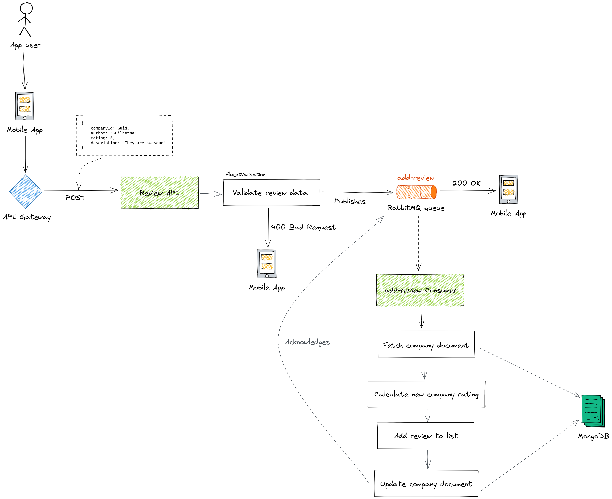

async-review-poc
---

- [Introduction](#introduction)
- [Diagram](#diagram)
- [Try it out](#try-it-out)
  * [Steps](#steps)
  * [Terminal example](#terminal-example)

## Introduction

This is a proof of concept for a piece of a software where users can submit reviews about companies. These reviews are processed asynchronously by a RabbitMQ consumer.

## Diagram



## Try it out

### Steps

1. Run MongoDB and RabbitMQ instances configured in `docker-compose.yml`;
2. Run both .NET 6 applications:
    - `AsyncReviewPoc.Api`
    - `AsyncReviewPoc.Consumers.AddReview`
3. Add a company thorugh HTTP: `POST /Company` (example below)
4. Post one or more reviews to the company through HTTP: `POST /Review` (example below)

### Terminal example

Copy and paste the commands below into your terminal:

```bash
## Navigate to this repository
cd /async-review-poc

## Start MongoDB and RabbitMQ using docker-compose
docker-compose up -d

## Start the Web Application that will receive reviews
cd ./src/AsyncReviewPoc.Api
dotnet run

## In another terminal window, run the consumer that will process reviews
cd ./src/AsyncReviewPoc.Consumers.AddReview
dotnet run

## Make a HTTP request to create a company
curl --location --request POST 'https://localhost:7237/Company' \
--header 'Content-Type: text/plain' \
--data-raw '{
  "id": "3fa85f64-5717-4562-b3fc-2c963f66afa6",
  "name": "Acme Corporation",
  "overallRating": 0
}'

## Make a HTTP request to post a review to the company
curl --location --request POST 'https://localhost:7237/Review' \
--header 'Content-Type: application/json' \
--data-raw '{
  "companyId": "3fa85f64-5717-4562-b3fc-2c963f66afa6",
  "author": "John Doe",
  "rating": 5,
  "description": "They are awesome"
}'
```

After posting some reviews with both applications running, you should expect to have the reviews and an average rating set in the company document.